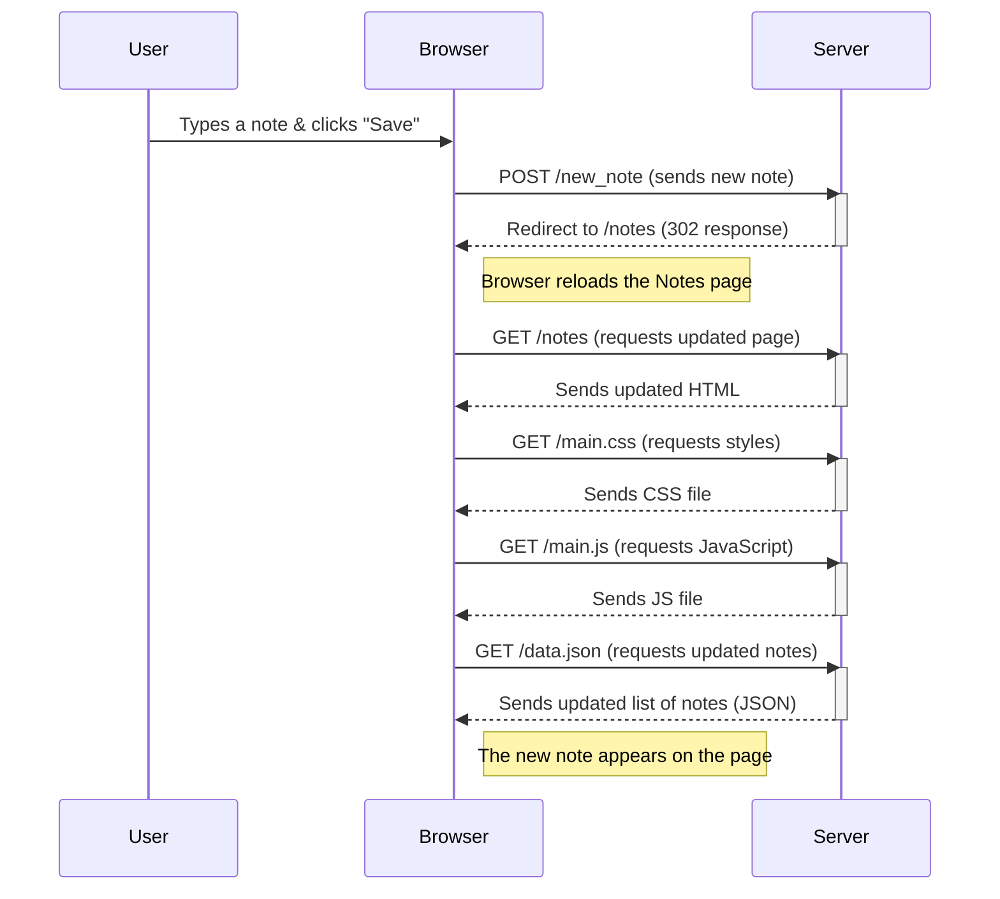

---

### 
- The user interacts with the **browser** (typing a note & clicking save).  
- The **browser sends the note** to the **server** via a `POST` request.  
- The **server processes the note**, adds it to the list, and tells the **browser to reload the page**.  
- The **browser reloads** and makes several **GET requests** to rebuild the page with updated notes.  
- Finally, the **new note appears** on the page.  
