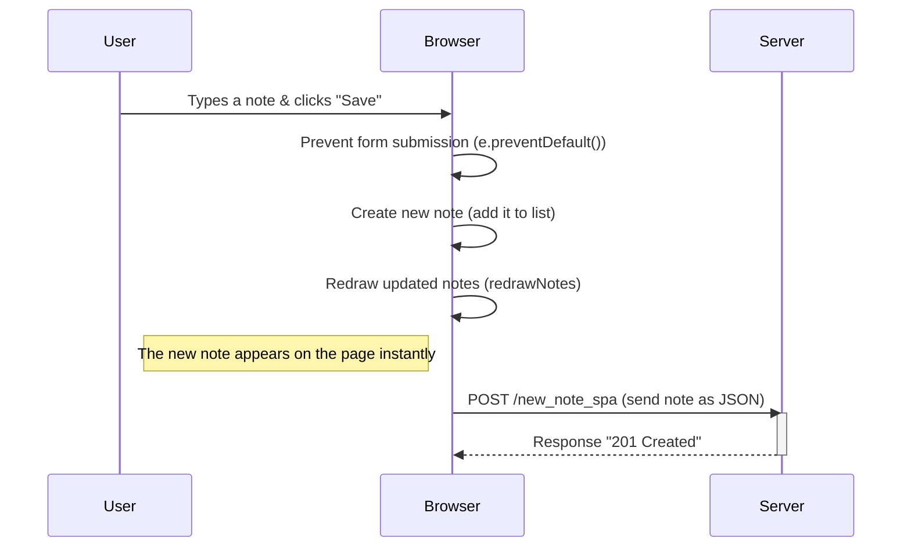

---

### 
1. **User Interaction**: The user types a note and clicks **"Save"**.  
2. **Preventing Default Form Behavior**: The browser prevents the usual form submission process with `e.preventDefault()`.  
3. **Create New Note Locally**: The browser creates the new note and adds it to the list of notes.  
4. **Redraw the Notes**: The browser immediately updates the page to display the new note using `redrawNotes()`.  
5. **Send Note to Server**: The browser **sends** the new note to the server as **JSON** using a **POST request** (`/new_note_spa`).  
6. **Server Responds**: The server responds with a **201 Created** status, meaning the note is successfully added.  
7. **Instant Update**: The new note is displayed on the page without a full reload.  

---

### **Key Differences (SPA vs Traditional)**:
- In **SPA**, the browser **doesn't reload** the page; it only **sends** data to the server and **updates the view locally**.
- The **server** only receives and processes the new note, but **does not control the page reload**.
