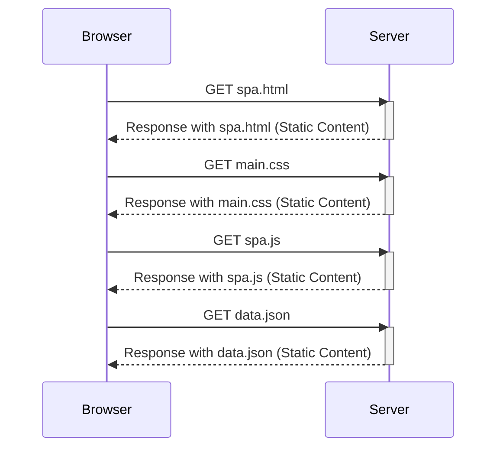

```mermaid
sequenceDiagram
    participant Browser
    participant Server

    Browser->>Server: GET spa.html
    activate Server
    Server-->>Browser: Response with spa.html (Static Content)
    deactivate Server

    Browser->>Server: GET main.css
    activate Server
    Server-->>Browser: Response with main.css (Static Content)
    deactivate Server

    Browser->>Server: GET spa.js
    activate Server
    Server-->>Browser: Response with spa.js (Static Content)
    deactivate Server

    Browser->>Server: GET data.json
    activate Server
    Server-->>Browser: Response with data.json (Static Content)
    deactivate Server


```
